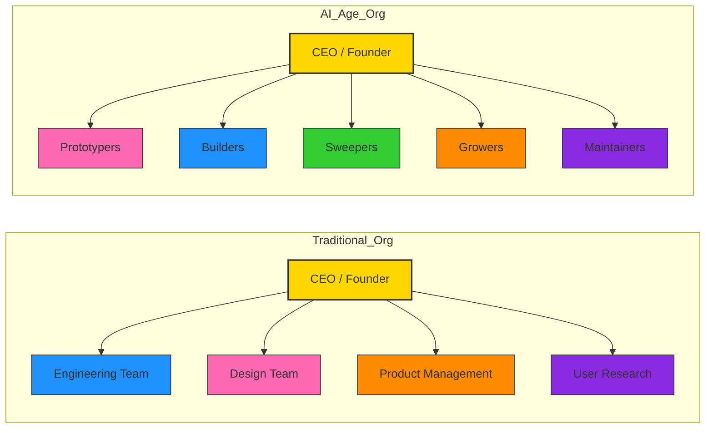

# Anyone Can Build: From Problem to App

Topics to discuss : 

1. Identifying everyday problems and turning them into app ideas
2. Fact-finding and research to understand the problem and user needs
3. Planning the app, including features, user flow and requirements
4. Building a functional app using free AI-powered tools
5. Testing, troubleshooting and improving the app
6. Turning a simple prototype into a practical working solution
7. Applying the same approach to build solutions for personal, workplace or business needs

# YANG PERLU TAHU

- CARA JIMAT TOKEN

- ASK ME RELEVANT QUESTIONS

- OPENCODE, GSD, OPENCHAMBER, TAILSCALE install

- MCP
  
  - 
  
  - Install https://github.com/microsoft/playwright-mcp for me. then in the currently opened document, do a google image search for krackeddevs logo, and put it inside the opened excel file
  
  - I have blender installed at `C:\Program Files\Blender Foundation\Blender 5.2` folder. install blender mcp to interact with it
  
  - 

- FORWARD DEPLOYED ENGINEER
  
  - 
  
  - 
  
  - 

- 

- AI VS TRADITIONAL ORGANIZATION

Great question — this is about the hierarchy of design concepts. Let’s break it down clearly:

## 🧩 Design Language

- **Definition:** The *visual and stylistic vocabulary* — colors, typography, shapes, iconography, tone.

- **Scope:** Focuses on *expression* and *aesthetic consistency*.

- **Example:** Dieter Rams’ principles translated into a palette, grid, and form rules.

## 🏗️ Design System

- **Definition:** A *structured toolkit* — components, patterns, documentation, code libraries, and governance.

- **Scope:** Focuses on *implementation and scalability*.

- **Example:** Material Design (Google) or Fluent Design (Microsoft), which include reusable UI components, accessibility rules, and developer guidelines.

## 🌐 Brand / Corporate Ecosystem

- **Definition:** The *umbrella framework* that encompasses **design language + design system + brand identity + corporate culture**.

- **Scope:** Goes beyond visuals and systems to include *mission, values, voice, customer experience, and brand strategy*.

- **Example:** Apple’s ecosystem — their design language (minimalist, tactile), design system (Human Interface Guidelines), and brand ethos (innovation, simplicity, premium).

### Hierarchy (from smaller to bigger):

1. **Design Language** → defines the *look and feel*.

2. **Design System** → operationalizes the language into *usable components*.

3. **Brand Ecosystem** → encompasses everything: design, messaging, culture, and experience.

👉 So to answer directly:

- A **design system** is bigger than a **design language** because it includes the language plus rules, components, and workflows.

- But the **largest umbrella** is the **brand/corporate design ecosystem**, which governs how the system and language fit into the company’s identity and customer experience.
